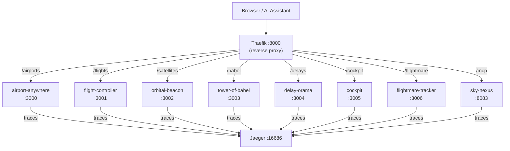
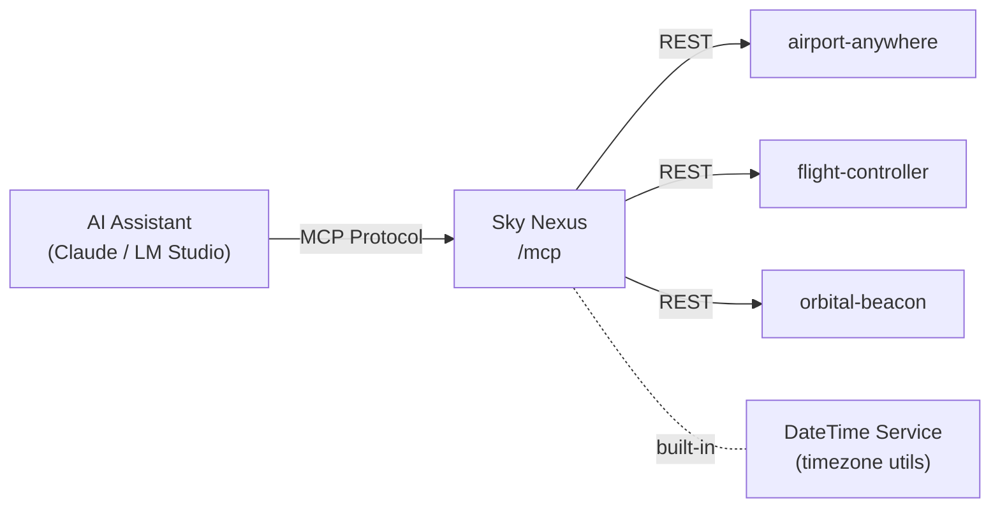
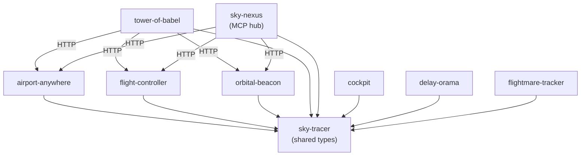

# sky-tracer-demo

Demo for Rust web services with Yew, Axum, Traefik, and MCP

[📽️ View Presentation](assets/index/presentation/index.html)

## 🧰 Tech Stack

| Layer | Technology |
|-------|-----------|
| Language | [Rust](https://www.rust-lang.org/) 1.94+ |
| Backend | [Axum](https://github.com/tokio-rs/axum) 0.8 — async HTTP framework built on Tokio |
| Frontend | [Yew](https://yew.rs/) 0.21 — React-like WebAssembly UI framework |
| Routing | [Traefik](https://traefik.io/) — reverse proxy and load balancer |
| Tracing | [OpenTelemetry](https://opentelemetry.io/) + [Jaeger](https://www.jaegertracing.io/) |
| API Docs | [utoipa](https://github.com/juhaku/utoipa) + Swagger UI |
| AI Integration | [Model Context Protocol (MCP)](https://modelcontextprotocol.io/) via [rmcp](https://github.com/modelcontextprotocol/rust-sdk) |
| Containers | Docker Compose |

## 🚀 Features

- ✈️ **Airport Information**: Complete airport database with search functionality
- 🛩️ **Flight Management**: Track and manage flights between airports
- 🛰️ **Satellite Positioning**: Real-time flight position calculation using orbital data
- ⏰ **Delay Tracking**: Monitor flight delays in real-time
- 🗺️ **Flight Map**: Interactive map visualization of live flight positions
- 🌐 **Web Frontends**: Modern web interfaces built with Yew/WebAssembly
- 🔄 **Axum Web Services**: High-performance async web services
- 🚦 **Traefik Integration**: Smart request routing and load balancing
- 🎯 **C4 Architecture**: Visualized system architecture using Structurizr
- 🐳 **Docker Compose**: Complete containerization of all components
- 📡 **Distributed Tracing**: End-to-end request tracing via OpenTelemetry and Jaeger
- 🤖 **MCP Server**: AI assistant integration via Model Context Protocol

## 🏗️ Architecture Overview

The system is organized as a Cargo workspace of independent microservices. All services are routed through a single **Traefik** reverse proxy at `http://localhost:8000`.



Each Rust service follows the same pattern: Axum routes, utoipa-generated OpenAPI docs, and OpenTelemetry tracing wired up via `init-tracing-opentelemetry`.

## 🤖 Sky Nexus — MCP Server

**Sky Nexus** is the AI integration hub of the stack. It acts as a central gateway that aggregates data from all backend microservices and exposes it through the [Model Context Protocol (MCP)](https://modelcontextprotocol.io/), allowing any MCP-compatible AI assistant (Claude, LM Studio, etc.) to query live aviation data without custom code.



### Available MCP Tools

| Category | Tools |
|----------|-------|
| Airports | `list_airports`, `get_airport` |
| Flights | `list_flights`, `get_flight`, `create_flight`, `search_flights_by_route` |
| Satellites | `list_satellites`, `create_satellite`, `update_satellite_status`, `calculate_position` |
| DateTime | `get_current_datetime`, `get_aviation_times`, `get_timezone_difference`, `compare_timezones` |
| Tracking | `get_flights_by_airport`, `get_flight_position` |

Sky Nexus also exposes a full REST API and Swagger UI at `/nexus/docs` for non-AI consumers.

## 🌐 Service Access

### Main Entry Point
- 📍 **Landing Page**: [http://localhost:8000](http://localhost:8000)
- 🎭 **Presentation**: [http://localhost:8000/presentation/](http://localhost:8000/presentation/)

### User Interfaces
- 🎯 **Cockpit Dashboard**: [http://localhost:8000/cockpit/](http://localhost:8000/cockpit/) — for flight staff
- ⏰ **Delay-O-Rama**: [http://localhost:8000/delays/](http://localhost:8000/delays/) — real-time delay view for travelers
- 😱 **Flightmare**: [http://localhost:8000/flightmare/](http://localhost:8000/flightmare/) — simulated chaos for travelers

### Core Services
- 🏢 **Airport Anywhere**: [http://localhost:8000/airports](http://localhost:8000/airports) — airport lookup and data
- 🎮 **Flight Controller**: [http://localhost:8000/flights](http://localhost:8000/flights) — flight CRUD and search
- 🛰️ **Orbital Beacon**: [http://localhost:8000/satellites](http://localhost:8000/satellites) — satellite tracking and positioning
- 🗼 **Tower of Babel**: [http://localhost:8000/babel](http://localhost:8000/babel) — aggregates data from all services
- 🤖 **Sky Nexus (MCP)**: [http://localhost:8000/mcp](http://localhost:8000/mcp) — AI assistant gateway

### API Documentation
- 📚 **Flight API Docs**: [http://localhost:8000/flights/api/docs](http://localhost:8000/flights/api/docs)
- 📚 **Sky Nexus API Docs**: [http://localhost:8000/nexus/docs](http://localhost:8000/nexus/docs)

### Infrastructure & Monitoring
- 🔄 **Traefik Dashboard**: [http://localhost:8080](http://localhost:8080)
- 📊 **Jaeger Tracing**: [http://localhost:16686](http://localhost:16686)
- 🏗️ **Architecture Docs**: [http://localhost:8082](http://localhost:8082)

## 👤 User Roles

| Role | Services |
|------|----------|
| ✈️ Flight Staff | Cockpit, Airport Anywhere |
| 🧳 Travelers | Delay-O-Rama, Flightmare Tracker |
| 🛸 Satellite Operators | Orbital Beacon |
| 🤖 AI Assistants | Sky Nexus MCP server |

## 🚀 Quick Start

### Prerequisites

- [Rust](https://www.rust-lang.org/tools/install) **1.94+** (install via `rustup`)
- [Docker](https://docs.docker.com/get-docker/) and [Docker Compose](https://docs.docker.com/compose/install/)
- [just](https://github.com/casey/just) command runner (`cargo install just`)

> **Tip:** Run `rustup update stable` to ensure you have the latest stable Rust toolchain (currently 1.94).

### Local Development

```sh
# Clone the repository
git clone https://github.com/chriamue/sky-tracer-demo.git
cd sky-tracer-demo

# Start all services via Docker Compose
just start

# View architecture documentation (Structurizr)
just structurizr
```

All services will be available at [http://localhost:8000](http://localhost:8000) within a few seconds.

## 🌐 Service URL Map

| Path | Service | Description |
|------|---------|-------------|
| `/airports` | airport-anywhere | Airport information lookup |
| `/flights` | flight-controller | Flight management |
| `/satellites` | orbital-beacon | Satellite positioning |
| `/cockpit` | cockpit | Flight monitoring dashboard |
| `/flightmare` | flightmare-tracker | Flight delay simulation |
| `/delays` | delay-orama | Real-time delay monitoring |
| `/babel` | tower-of-babel | Flight aggregation API |
| `/mcp` | sky-nexus | MCP server for AI assistants |

Additional infrastructure:

| URL | Description |
|-----|-------------|
| http://localhost:8080 | Traefik Dashboard |
| http://localhost:8082 | Structurizr Architecture Docs |
| http://localhost:16686 | Jaeger Distributed Tracing |

## 🔗 MCP Integration

### Configure LM Studio

Start the stack, then add to your `mcp.json` in LM Studio (Program tab → Install → Edit mcp.json):

```json
{
  "mcpServers": {
    "sky-nexus": {
      "url": "http://localhost:8000/mcp"
    }
  }
}
```

### Configure Claude Desktop

Add to your Claude Desktop config file:

```json
{
  "mcpServers": {
    "sky-nexus": {
      "url": "http://localhost:8000/mcp"
    }
  }
}
```

### Test with MCP Inspector

```sh
npx @modelcontextprotocol/inspector http://localhost:8000/mcp
```

## 📝 Available Commands

```sh
# Start all services
just start

# View service logs
just logs

# Stop all services
just down

# View architecture documentation
just structurizr

# Stop Structurizr
just structurizr-down

# Run tests
just test

# Check code formatting
just fmt

# Run linter
just lint
```

## 🗂️ Project Structure

```
sky-tracer-demo/
├── assets/                 # Shared assets and data files
├── crates/                 # Rust workspace crates
│   ├── airport-anywhere/   # Airport lookup service
│   ├── cockpit/            # Staff dashboard (Yew frontend)
│   ├── delay-orama/        # Delay monitoring (Yew frontend)
│   ├── flight-controller/  # Flight management service
│   ├── flight-map/         # Shared flight map component
│   ├── flightmare-tracker/ # Delay simulation service
│   ├── orbital-beacon/     # Satellite positioning service
│   ├── sky-nexus/          # MCP server (AI integration hub)
│   ├── sky-tracer/         # Shared protocol definitions
│   └── tower-of-babel/     # Flight aggregation service
└── docs/                   # Architecture documentation (Structurizr)
```

### Service Dependency Flow



## 📊 Data Sources

### airports.dat

The file `airports.dat` is sourced from the [OpenFlights](https://github.com/jpatokal/openflights) database, providing comprehensive airport data including IATA/ICAO codes, coordinates, timezone information, and more.

## 📝 License

This project is licensed under the MIT License — see the [LICENSE](LICENSE) file for details.